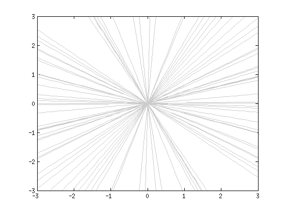
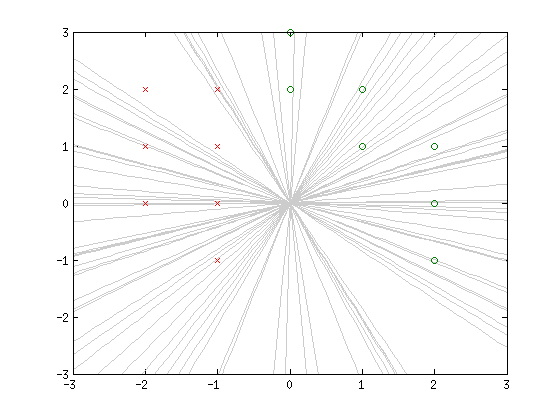
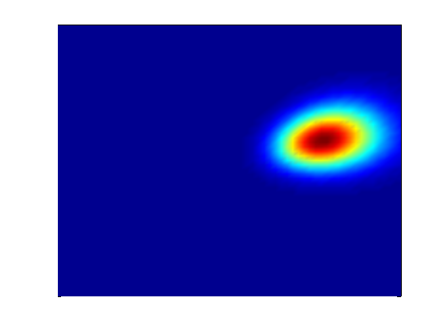

The Bayesian approach to machine learning replaces the sauce of optimization by that of probability. Instead of maximizing the likelihood, it introduces priors to the parameters and calculates the posterior distribution of the parameters after seeing all the data, using Bayes' rule (of course!). The posterior distributions capture our beliefs about the parameters, and they are definitely more informative than a single optimal set of parameters learned from maximizing the likelihood. However the extra information comes at a price, since inferring about the posterior is often computationally expensive. For carefully chosen priors and likelihood (conjugacy), it is possible to get analytical solution for the posterior, but unfortunately in reality this is rarely the case, even for the simple logistic regression model.

The logistic regression model is widely used in classification. For simplicity and visualization purposes we will study a simple 2d classification problem, where we assume that the data points can be separated by a line passing through the origin. This is of course a bad assumption in general, but who cares -- no model is perfect anyways.

For logistic regression, we take the probability of a data point $(x_i, y_i) \in \mathbb{R}^2$ belonging to class $z_i \in \{0, 1\}$ as
\begin{equation}
P(Z = 0 | X = (x_i, y_i), A = a, B = b) = \frac{1}{1 + exp(-ax_i - by_i)},
\end{equation}
where $A$, $B$ are the parameters in our model. In a Bayesian's eyes, they are not cold-blooded reptiles (a number) but warm-blooded mammals (random variables). Wait, I love mammals, but what is our prior belief about them, before seeing any training examples? While, I don't have any, my intuition is just that any line is equally likely to separate the positive and negative training examples. How does that translates to the priors of $A$ and $B$?

For that, let's look at the probability of points belonging to the opposite class
\begin{equation}
P(Z = 1 | X = (x_i, y_i), A = a, B = b) = 1 - P(Z = 0 | X = (x_i, y_i), A = a, B = b) = \frac{exp(-ax_i - by_i)}{1 + exp(-ax_i - by_i)}.
\end{equation}
If the point $(x_i, y_i)$ happens to lie on the decision boundary, we must have
\begin{equation}
P(Z = 1 | X = (x_i, y_i), A = a, B = b) = P(Z = 0 | X = (x_i, y_i), A = a, B = b).
\end{equation}
This corresponds to the condition
\begin{equation}
ax_i + by_i = 0.
\end{equation}
If a point $(x_i, y_i)$ lies on the decision boundary, it must satisfy the above equation. In other words, the decision boundary is defined by $ax + by = 0$, a line passing through the origin! Great, now the model perfectly resonates with our initial assumptions. The last dessert to make is to define the priors for $A$ and $B$ such that it reflects our belief that any line is equally likely. This is in fact very tricky. We have to formalize the term *equally likely*. One way to formalize it is to say that the slope of the line is uniformly distributed in $\mathbb{R}$. But what is an uniform distribution in $\mathbb{R}$? The answer is that there is **no** uniform distribution in $\mathbb{R}$! This weired object is opposite to the $\delta$-distribution, but unfortunately is not well-defined in any mathematical framework (distribution theory, measure theory) to the best of my knowledge. It can be seen as a limit of an uniform distribution in $[-M, M]$ as $M \rightarrow \infty$, or as the stationary distribution of a Brownian motion as $t \rightarrow \infty$. OK, I feel that I'm ranting on it too much. Let's try to formalize it in another way. We can say that the angle formed by the line and the positive x-axis is uniformly distributed in $[-\pi/2, \pi/2]$. This is well defined, and the angle is related to the slope through a nonlinear map $\Theta \mapsto \tan(\Theta)$. What is corresponding distribution of the slope you might ask? It is the Cauchy distribution. Uniformity in angle is essentially different from uniformity in slope, a phenomena similar to Bertrand paradox. Anyway, we can now at least realize our second formalization by sampling $\Theta$ uniformly in $[-\pi/2, \pi/2]$, and take $A = \sin\Theta$ and $B = \cos\Theta$. It turns out there is a way to generate Cauchy distribution even when $A$ and $B$ are independent. If $A$ and $B$ are independent standard normal distributions, their ratio $A/B$ (or equivalently the actual slope $-A/B$) is Cauchy distributed. Here let's adopt this approach, because the Gaussian (normal) prior is extremely popular and we've proved that it satisfies our prior belief in this case.

Let's first draw some samples from the prior and see how they look like. Below is a plot of 50 random lines drawn from our prior:

<div class="bigcenterimgcontainer">

</div>

Seem pretty uniform, aren't they? Here is the density of the joint probability density of $(A, B)$:

<div class="bigcenterimgcontainer">

</div>

Now let's make some toy training examples :)

<div class="bigcenterimgcontainer">

</div>

Given the set of training examples $\{(x_1, y_1, z_1), (x_2, y_2, z_2), \ldots, (x_n, y_n, z_n)\}$, the likelihood is
\begin{equation}
P(Z = \mathbf{z} | X = (\mathbf{x}, \mathbf{y}), A = a, B = b) = \prod_{i = 1}^n \frac{exp(z_i(-ax_i - by_i))}{1 + exp(-ax_i - by_i)}.
\end{equation}
The posterior distribution is then proportional to the prior times the likelihood:
\begin{equation}
P(A, B|X, Z) \propto P(A)P(B)P(Z|X, A, B).
\end{equation}
Unfortunately there is no analytical solution for the posterior, because $P(A)$ and $P(B)$ are Gaussians but the likelihood $P(Z|X, A, B)$ is a product of logistic functions. In order to get a feeling what the posterior looks like, let's calculate $P(A)P(B)P(Z|X, A, B)$ for a square grid of $(a, b)$ ranging from -3 to 3, with a step size of 0.1:

<div class="bigcenterimgcontainer">

</div>

We can see that after seeing the training examples, our beliefs about $A$ and $B$ shifted. The approximate mode, or the point that has the maximum probability in the grid, is (1.6, 0.4). The corresponding (unnormalized) posterior probability is 0.005.

Now let's try to sample some lines from the posterior. To do this I first generate a random number $r$ between $0$ and $1$. Then I sample a point $(a, b)$ uniformly in the square $[-3, 3] \times [-3, 3]$, and calculates $P(A=a)P(B=b)P(Z|X, A=a, B=b)$. If this unnormalized posterior probability is less than $0.005r$, I will keep it. Otherwise I will reject it. This idea is called rejection sampling, and one can show that the sampled points will follow the posterior distribution. The fact that I'm only sampling $(a, b)$ in a small square does not affect the result so much, because I can tell that most densities are included in this region from the previous plot. Below is a plot of running rejection sampling for 1000 iterations. The grey lines are rejected lines and black lines are approved samples. The thick red line corresponds to the mode.

<div class="bigcenterimgcontainer">

</div>

The number of training examples influences the variance of the posterior. Here we have 7 positive and 7 negative examples, and we can see that we are already pretty confident about our beliefs. If we only have 6 training instances instead (less evidence), the picture would look like this:

<div class="bigcenterimgcontainer">

</div>

Finally, to make predictions, given a test data point $X^*$, the Bayesian approach is to average across all possible parameters:
\begin{equation}
P(Z^*|X^*, Z, X) = \int P(Z^*|X^*, A, B)P(A, B|X, Z)dAdB.
\end{equation}
Again the integral is a monster, but we can approximate it by sampling. For example, I can take the grid points in the $[-3, 3] \times [-3, 3]$ square as a rough approximation to the posterior, and make predictions by summing over all those points. For a test point $(-1, 0)$, this will return us a probability of 0.1597, so we are pretty confident that it belongs to the red class. For a test point of $(1, 0)$, the probability is 0.8403, safe to say it is green.

A quick exercise: what will the learned model predict for the point $(0, 0)$? Does the choice of prior and training examples influence the prediction for $(0, 0)$? Why?

Code used in this study:

```matlab
% randn('seed', 0);
% rand('seed', 0);

% prior
mu = 0;
sigma = 1;

% draw samples from prior
box = 3;
x = -box:0.1:box;
for i = 1:50
    a = normrnd(mu, sigma);
    b = normrnd(mu, sigma);
    plot(x, -a/b * x, 'color', [0.8 0.8 0.8]);
    hold on
end
axis([-box box -box box]);

% draw prior density
[X, Y] = meshgrid(normpdf(x, mu, sigma), normpdf(x, mu, sigma));
pcolor(X.*Y);
shading('interp');
set(gca, 'XTick', [], 'YTick', []);

% observed data
pos = [1, 1; 2, 0; 2, 1; 0, 2; 1, 2; 0, 3; 2, -1];
neg = [-1, 1; -1, 0; -1, -1; -1, 2; -2, 0; -2, 1; -2, 2];
scatter(pos(:, 1), pos(:, 2), 'o');
scatter(neg(:, 1), neg(:, 2), 'x');

% draw posterior density
prob_mat = zeros(length(x));
for j = 1:length(x)
    for k = 1:length(x)
        a = x(j);
        b = x(k);
        prob = normpdf(a, mu, sigma) * normpdf(b, mu, sigma);
        for i = 1:size(pos, 1)
            prob = prob * 1/(1 + exp(-a * pos(i, 1) - b * pos(i, 2)));
        end
        for i = 1:size(neg, 1)
            prob = prob * (1 - 1/(1 + exp(-a * neg(i, 1) - b * neg(i, 2))));
        end
        prob_mat(j, k) = prob;
    end
end
pcolor(transpose(prob_mat));
shading('interp');
set(gca, 'XTick', [], 'YTick', []);

% draw samples from posterior by rejection sampling
for j = 1:1000
    a = -3 + rand()*6;
    b = -3 + rand()*6;
    prob = normpdf(a, mu, sigma) * normpdf(b, mu, sigma);
    for i = 1:size(pos, 1)
        prob = prob * 1/(1 + exp(-a * pos(i, 1) - b * pos(i, 2)));
    end
    for i = 1:size(neg, 1)
        prob = prob * (1 - 1/(1 + exp(-a * neg(i, 1) - b * neg(i, 2))));
    end
    u = rand();
    if prob / max(prob_mat(:)) > u
        % accept
        plot(x, -a/b * x, 'color', [0.2 0.2 0.2]);
    else
        % reject
        plot(x, -a/b * x, 'color', [0.8 0.8 0.8]);
    end
    hold on
end
axis([-box box -box box]);

% the mean line
[maxp, I] = max(prob_mat(:));
[maxj, maxk] = ind2sub(size(prob_mat), I);
maxa = x(maxj);
maxb = x(maxk);
plot(x, -maxa/maxb * x, 'color', [1 0 0], 'LineWidth', 2);
hold on

% test data point
test = [1, 0];
norm_prob = prob_mat / sum(prob_mat(:));
p = 0;
for j = 1:length(x)
    for k = 1:length(x)
        a = x(j);
        b = x(k);
        p = p + norm_prob(j, k) * 1/(1 + exp(-a * test(1) - b * test(2)));
    end
end
```
