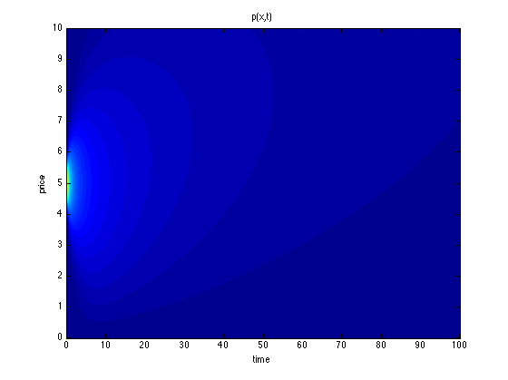

Consider the following problem:

> The price of a stock is described by a Brownian motion. Suppose the starting price is 5, and the company defaults if ever the price drops to zero. What is the probability that the company is bankrupt at time $T$? What is the probability that the price is above 10 at time $T$?

Let's say the price of the stock is described by the time series $p(t)$. The company is bankrupt at time $T$ if $\exists s \le T$, such that $p(s) = 0$. By the reflection principle of Brownian motion, 
\begin{equation}
P\left(inf_{0\le s\le T}p(s) \le 0\right) = 2P\left(p(T) \le 0\right) = 2\int_{-\infty}^{-5}\frac{1}{\sqrt{2\pi T}}e^{\frac{-x^2}{2T}}dx.
\end{equation}
For the second question, we need $p(T) > 10$ and $p(s) > 0, \forall 0 \le s \le T$. The probability can be calculated as 
\begin{equation}
P\left(p(T) > 10\right) - P\left(p(T) > 10 \cap inf_{0\le s\le T}p(s) \le 0\right),
\end{equation}
using the fact that $P(A\cap B) = P(A) - P(A\cap B^\complement)$. Note that the latter part is equal to $P\left(p(T) < -10\right)$ (Imagine the price first hits zero, then the probability that it goes back above 10 is equal to a reflecting process that drops below -10). Therefore the probability that the price is above 10 at time $T$ is
\begin{equation}
P\left(p(T) < 0\right) - P\left(p(T) < -10\right) = P\left(-10 \le p(T) < 0\right) = \int_{-15}^{-5}\frac{1}{\sqrt{2\pi T}}e^{\frac{-x^2}{2T}}dx.
\end{equation}

Now let's solve the problem in another way. We know that Brownian motion is governed by the following partial differential equation
\begin{equation}
p_t(x, t) = Dp_{xx}(x, t),
\end{equation}
where $p(x,t)$ is the probability density. For a standard Brownian motion, we have $D = 1/2$. Going back to our problem, we know the stock price satisfies this PDE, with boundary conditions $p(0, t) = 0$ and $p(x, t) \rightarrow 0, x \rightarrow \infty$. The absorbing boundary condition reflects the fact that once the price drops to zero, we are at the point of no return. The initial condition for the density is given by $p(x, 0) = \delta(x - 5)$.

To solve for this PDE with the above initial and boundary conditions, one common trick is to apply the Green function and the method of images. That is, we imagine another point source that is outside of the domain (at $x = -5$) which counteracts the point source at $x = 5$ to give us the boundary condition. The solution is therefore the superposition of two Green functions
\begin{equation}
p(x, t) = G(5) - G(-5) = \frac{1}{\sqrt{2\pi t}}\left(e^{\frac{-(x-5)^2}{2t}} - e^{\frac{-(x+5)^2}{2t}} \right).
\end{equation}
See a plot of this density:

The probability that the company is bankrupt at $T$ is given by
\begin{equation}
1 - \int_0^\infty p(x, T).
\end{equation}
The probability that the price is above 10 at $T$ is given by
\begin{equation}
\int_{10}^\infty p(x, T).
\end{equation}
We can see the close relationship between the method of images and the reflection principle of Brownian motion.

